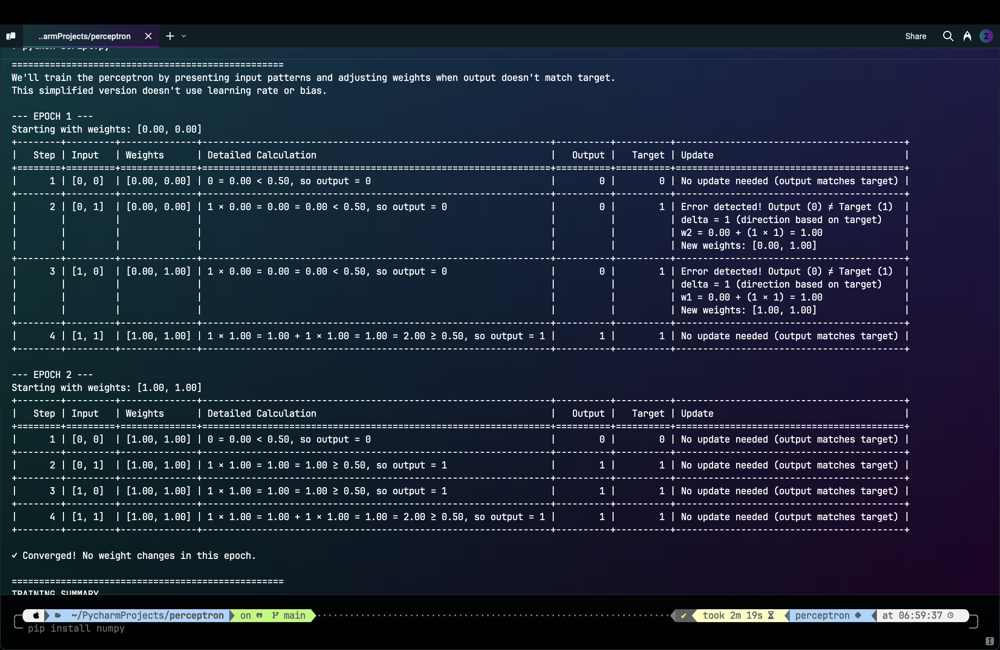

# Perceptron Learning Algorithm Simulator

A Python implementation of the perceptron learning algorithm for educational purposes. This simulator demonstrates how a single perceptron learns to approximate binary logic functions.

## Overview

The perceptron is one of the earliest machine learning algorithms, designed to mimic how a single brain neuron works. This project provides a detailed, step-by-step visualization of:

- How a perceptron processes binary inputs
- How weights and biases are adjusted during learning
- How different logical functions can be learned (or not) by a single perceptron

## Features

- Interactive command-line interface
- Support for any logical function using Python syntax
- Detailed step-by-step explanation of the learning process
- Visualizations of weights, biases, and thresholds
- Verification of model accuracy
- Support for different levels of detail (basic, detailed, none)
- Option to use simple perceptron or full perceptron with bias and learning rate
- Suggestions for initial parameters based on function type
- Non-interactive demo mode showcasing multiple common logic functions

## Installation

### Requirements
- Python 3.13 or higher
- numpy (>=2.2.3)
- tabulate (>=0.9.0)

### Using pip

```bash
# Clone the repository
git clone https://github.com/yourusername/perceptron-learning-visualizer.git
cd perceptron-learning-visualizer

# Install dependencies
pip install -r requirements.txt

# Or install as an editable package
pip install -e .
```

### Using uv (recommended)

```bash
# Clone the repository
git clone https://github.com/yourusername/perceptron-learning-visualizer.git
cd perceptron-learning-visualizer

# Install dependencies with uv (faster, more reliable)
uv pip install -e .

# If you don't have uv installed:
# pip install uv
# uv pip install -e .
```

### Quick Test

To verify your installation:

```bash
# Run a simple test with AND function
python test_run.py
```

## Usage

### Interactive Mode

Run the main script to start the interactive simulator:

```bash
python script.py
```

Follow the prompts to:
1. Choose explanation detail level
2. Enter a logical function (e.g., "a and b", "a or b", "not a", "a != b")
3. Configure perceptron parameters (or use suggested defaults)
4. Watch the learning process and results

Example interactive session:
```
Choose detail level (1-3, default 3): 2
Enter logical function: a and b
Use simple mode without learning rate and bias? (y/n, default n): n
Use these suggested parameters? (y/n, default y): y
```

### Demo Mode

To see predefined examples without user input:

```bash
python demo.py
```

This will demonstrate various logical functions including:
- AND function
- OR function 
- NOT function
- NAND function
- XOR function (showing limitations of single-layer perceptrons)
- Complex functions with 3+ variables

### Command-Line Interface

For more flexibility, use the CLI tool:

```bash
python cli.py --function "a and b" --detail basic
```

#### Options:

- `--function`, `-f`: The logical function to learn (required)
- `--simple`, `-s`: Use simple perceptron mode (no bias or learning rate)
- `--detail`, `-d`: Level of detail: none, basic, or detailed (default: basic)
- `--epochs`, `-e`: Maximum number of training epochs (default: 100)
- `--learning-rate`, `-lr`: Learning rate for weight updates (default: 1.0)
- `--threshold`, `-t`: Activation threshold (optional)
- `--bias`, `-b`: Initial bias value (optional)
- `--weights`, `-w`: Comma-separated initial weights (optional)
- `--skip-zeros`: Skip all-zeros input during training
- `--explain`: Show an explanation of the perceptron learning algorithm

#### Examples:

```bash
# Train an AND function with detailed explanations
python cli.py --function "a and b" --detail detailed

# Train an OR function with simple perceptron
python cli.py --function "a or b" --simple

# Train XOR with custom parameters
python cli.py --function "a != b" --learning-rate 0.5 --bias 0 --threshold 0.5

# Train a complex function with custom weights
python cli.py --function "(a or b) and c" --weights "0.5,0.5,0.5"
```

## Sample Output

### AND Function Training

```
PERCEPTRON CONFIGURATION
+----------------+----------+
| Logic Function | a and b  |
| Number of      | 2        |
| Variables      |          |
| Variable Names | a, b     |
| Learning Rate  | 1        |
| Threshold      | 1.50     |
| Initial Bias   | -0.1     |
| Initial        | All zeros|
| Weights        |          |
| Skip All-Zeros | No       |
| Input          |          |
| Max Epochs     | 100      |
+----------------+----------+

TRUTH TABLE FOR: a and b
+---+---+----------------+
| a | b | Expected Output|
+---+---+----------------+
| 0 | 0 | 0              |
| 0 | 1 | 0              |
| 1 | 0 | 0              |
| 1 | 1 | 1              |
+---+---+----------------+

Final weights: [1.00, 1.00]
Final bias: -0.10

Accuracy: 100.0%
```

### XOR Function (showing limitations)

```
VERIFICATION OF TRAINED PERCEPTRON
+-------------+------------------+------------------+---------------+---------+
| Input       | Detailed         | Perceptron       | Expected      | Correct?|
|             | Calculation      | Output           | Output        |         |
+-------------+------------------+------------------+---------------+---------+
| [0, 0]      | 0.00 = 0.00 <    | 0                | 0             |        |
|             | 0.50, so output  |                  |               |         |
|             | = 0              |                  |               |         |
+-------------+------------------+------------------+---------------+---------+
| [0, 1]      | 1 W 1.00 = 1.00  | 1                | 1             |        |
|             | + 0.00 = 1.00 e  |                  |               |         |
|             | 0.50, so output  |                  |               |         |
|             | = 1              |                  |               |         |
+-------------+------------------+------------------+---------------+---------+
| [1, 0]      | 1 W 1.00 = 1.00  | 1                | 1             |        |
|             | + 0.00 = 1.00 e  |                  |               |         |
|             | 0.50, so output  |                  |               |         |
|             | = 1              |                  |               |         |
+-------------+------------------+------------------+---------------+---------+
| [1, 1]      | 1 W 1.00 = 1.00  | 1                | 0             |        |
|             | + 1 W 1.00 =     |                  |               |         |
|             | 1.00 + 0.00 =    |                  |               |         |
|             | 2.00 e 0.50, so  |                  |               |         |
|             | output = 1       |                  |               |         |
+-------------+------------------+------------------+---------------+---------+

Accuracy: 3/4 correct predictions (75.0%)

  Note: The perceptron couldn't achieve 100% accuracy.
This is because XOR is not linearly separable, which means a single perceptron
cannot learn this function perfectly. You would need a multi-layer network.
```

## Screenshots



## How It Works

The perceptron works by:

1. **Initialization**: Starting with random or zero weights and bias
2. **Forward Pass**: For each input pattern:
   - Calculate weighted sum of inputs plus bias
   - Apply threshold function to get output (0 or 1)
3. **Weight Update**: If output doesn't match target:
   - Calculate error = (target - output)
   - Update weights: new_weight = old_weight + learning_rate * error * input_value
   - Update bias: new_bias = old_bias + learning_rate * error
4. **Repeat**: Continue until weights converge or maximum epochs reached

## Project Structure

- `script.py` - Main interactive script
- `demo.py` - Non-interactive demos of different logic functions
- `cli.py` - Command-line interface for flexibility
- `perceptron.py` - Implementation of the perceptron learning algorithms
- `utils.py` - Utility functions for calculations and parameter suggestions
- `visualization.py` - Functions for displaying tables and results
- `explanations.py` - Text explanations of perceptron concepts
- `test_run.py` - Simple test script for basic verification

## Limitations

Single-layer perceptrons can only learn linearly separable functions. This means:

- Can learn: AND, OR, NOT, NAND, NOR
- Cannot learn: XOR (exclusive OR) and other non-linearly separable functions

To learn XOR and more complex functions, multi-layer networks (neural networks) are required.

## License

[MIT License](LICENSE)

## Acknowledgements

This educational tool was developed as part of a university module on machine learning basics. It is designed to help understand the foundational concepts of perceptrons before moving on to more complex neural networks.